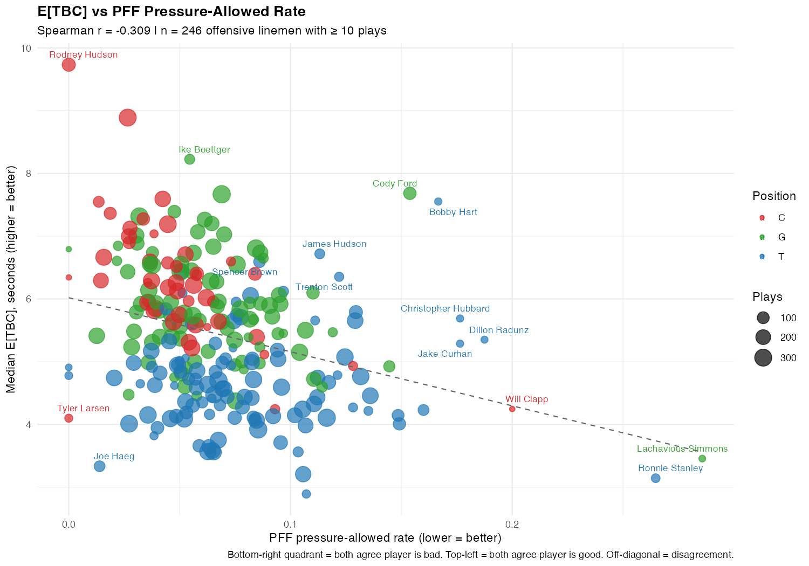

```{r setup, include=FALSE}
knitr::opts_chunk$set(echo = FALSE, message = FALSE, warning = FALSE)
suppressPackageStartupMessages({
  library(tidyverse)
  library(knitr)
  library(kableExtra)
})

root <- rprojroot::find_root(rprojroot::has_file("README.md"))

rusher_ranking  <- read_csv(file.path(root, "data/processed/etbc_rusher_ranking.csv"),  show_col_types = FALSE)
blocker_ranking <- read_csv(file.path(root, "data/processed/etbc_blocker_ranking.csv"), show_col_types = FALSE)
comparison      <- read_csv(file.path(root, "data/processed/etbc_vs_pff_comparison.csv"), show_col_types = FALSE)

ol_positions  <- c("T", "G", "C")
dl_positions  <- c("DE", "DT", "NT", "OLB", "ILB", "MLB", "LB")
```

# What is E[TBC]?

> **E[TBC] is the expected number of seconds until a specific pass rusher physically reaches the QB**, given the rusher's current position, speed, and direction.

It answers the only question coaches actually ask in real time: *"how much time does my QB have?"*

## The math

For every rusher on every frame, using only that frame's snapshot:

$$
E[TBC] = \frac{\text{distance from rusher to QB}}{\text{closing speed along rusher} \rightarrow \text{QB direction}}
$$

- If the rusher is not moving toward the QB → E[TBC] = ∞
- If the rusher is already within 1 yard of the QB → E[TBC] = 0 (contact made)
- Otherwise: distance ÷ closing speed, in seconds

## Relationship to PRSS

| | **PRSS** | **E[TBC]** |
|---|---|---|
| Unit | sq yards / frame | seconds |
| Measures | how fast space is disappearing | when contact will happen |
| Looks | backward | forward |
| Grades | offensive line as a unit | individual rushers and blockers |
| Rolling window? | yes (k = 5 frames) | no — per-frame |

**PRSS tells you the pocket is shrinking. E[TBC] tells you who's about to break it, and when.**

---

# Rusher Rankings

A rusher's E[TBC] grade = the **median E[TBC] they generate** across all their pass-rush frames. **Lower = better rusher** (they reach the QB faster).

## Top 20 pass rushers (DL + LB, ≥ 50 plays)

```{r}
rusher_ranking %>%
  filter(rusher_pos %in% dl_positions, n_plays >= 50) %>%
  arrange(median_etbc) %>%
  head(20) %>%
  transmute(
    Rank        = row_number(),
    Player      = rusher_name,
    Position    = rusher_pos,
    Plays       = n_plays,
    `Median E[TBC] (s)` = round(median_etbc, 2),
    `Mean E[TBC] (s)`   = round(mean_etbc,   2),
    `% under 2s`        = scales::percent(pct_under_2sec, accuracy = 0.1),
    `% under 1s`        = scales::percent(pct_under_1sec, accuracy = 0.1)
  ) %>%
  kable() %>%
  kable_styling(bootstrap_options = c("striped", "hover", "condensed"), full_width = FALSE)
```

---

# Offensive Line Rankings

A blocker's E[TBC] grade = the **median E[TBC] of the rusher they were assigned to block** (per PFF's `pff_nflIdBlockedPlayer`). **Higher = better blocker** (their assigned rusher stayed further from the QB).

## Top 15 Centers

```{r}
blocker_ranking %>%
  filter(blocker_pos == "C", n_plays >= 50) %>%
  arrange(desc(median_etbc)) %>%
  head(15) %>%
  transmute(
    Rank        = row_number(),
    Player      = blocker_name,
    Plays       = n_plays,
    `Median E[TBC] (s)` = round(median_etbc, 2),
    `PFF pressure-allowed rate` = scales::percent(pct_pressure_allow, accuracy = 0.1)
  ) %>%
  kable() %>%
  kable_styling(bootstrap_options = c("striped", "hover", "condensed"), full_width = FALSE)
```

## Top 15 Guards

```{r}
blocker_ranking %>%
  filter(blocker_pos == "G", n_plays >= 50) %>%
  arrange(desc(median_etbc)) %>%
  head(15) %>%
  transmute(
    Rank        = row_number(),
    Player      = blocker_name,
    Plays       = n_plays,
    `Median E[TBC] (s)` = round(median_etbc, 2),
    `PFF pressure-allowed rate` = scales::percent(pct_pressure_allow, accuracy = 0.1)
  ) %>%
  kable() %>%
  kable_styling(bootstrap_options = c("striped", "hover", "condensed"), full_width = FALSE)
```

## Top 15 Tackles

```{r}
blocker_ranking %>%
  filter(blocker_pos == "T", n_plays >= 50) %>%
  arrange(desc(median_etbc)) %>%
  head(15) %>%
  transmute(
    Rank        = row_number(),
    Player      = blocker_name,
    Plays       = n_plays,
    `Median E[TBC] (s)` = round(median_etbc, 2),
    `PFF pressure-allowed rate` = scales::percent(pct_pressure_allow, accuracy = 0.1)
  ) %>%
  kable() %>%
  kable_styling(bootstrap_options = c("striped", "hover", "condensed"), full_width = FALSE)
```

## Bottom 15 OL across all positions

```{r}
blocker_ranking %>%
  filter(blocker_pos %in% ol_positions, n_plays >= 50) %>%
  arrange(median_etbc) %>%
  head(15) %>%
  transmute(
    Rank        = row_number(),
    Player      = blocker_name,
    Position    = blocker_pos,
    Plays       = n_plays,
    `Median E[TBC] (s)` = round(median_etbc, 2),
    `PFF pressure-allowed rate` = scales::percent(pct_pressure_allow, accuracy = 0.1)
  ) %>%
  kable() %>%
  kable_styling(bootstrap_options = c("striped", "hover", "condensed"), full_width = FALSE)
```

---

# Head-to-head: E[TBC] vs. PFF Pressure-Allowed Rate

If E[TBC] and PFF measured the same thing, we'd see a **strong negative correlation** (higher E[TBC] should mean lower pressure rate).

```{r}
cor_by_pos <- comparison %>%
  filter(n_plays >= 10) %>%
  group_by(blocker_pos) %>%
  summarise(
    n = n(),
    spearman = cor(median_etbc, pct_pressure_allow, method = "spearman"),
    pearson  = cor(median_etbc, pct_pressure_allow, method = "pearson"),
    .groups = "drop"
  )

cor_by_pos %>%
  filter(blocker_pos %in% ol_positions) %>%
  transmute(
    Position = blocker_pos,
    `n OL`   = n,
    `Spearman r` = round(spearman, 3),
    `Pearson r`  = round(pearson, 3)
  ) %>%
  kable() %>%
  kable_styling(bootstrap_options = c("striped", "hover"), full_width = FALSE)
```

**Key finding:** Centers show strong agreement (r ≈ -0.57). Tackles show essentially **no relationship** (r ≈ 0.04). PFF's grades for the most-paid position group on the OL may not be measuring what people think they measure.

## Scatter plot



Lower-right quadrant = both metrics say the player is bad. Upper-left = both say good. Off-diagonal = disagreement between metrics.

## Notable disagreements (potential talking points)

```{r}
comparison %>%
  filter(n_plays >= 30, blocker_pos %in% ol_positions) %>%
  arrange(desc(disagreement)) %>%
  head(10) %>%
  transmute(
    Player    = blocker_name,
    Position  = blocker_pos,
    Plays     = n_plays,
    `Median E[TBC] (s)` = round(median_etbc, 2),
    `PFF pressure rate` = scales::percent(pct_pressure_allow, accuracy = 0.1),
    `E[TBC] z-score`    = round(etbc_z,    2),
    `PFF z-score`       = round(pff_z_inv, 2),
    `Disagreement`      = round(disagreement, 2)
  ) %>%
  kable() %>%
  kable_styling(bootstrap_options = c("striped", "hover", "condensed"), full_width = FALSE)
```

---

# Method notes

- **Tracking data**: NFL Big Data Bowl 2022 (2021 season, weeks 1–8)
- **Pass rusher / blocker identification**: PFF scouting data (`pff_role`)
- **Blocker-rusher assignment**: PFF's `pff_nflIdBlockedPlayer`
- **Pass plays**: only frames between snap and ball release / sack / spike
- **Sample size threshold**: ≥ 50 plays for headline rankings; ≥ 10 for the comparison
- **Position adjustment**: PFF correlation analysis is computed within position to control for the structural difference between tackle and interior matchups

## Parameters

| Parameter | Value | Purpose |
|---|---|---|
| `CONTACT_RADIUS` | 1.0 yd | Distance at which "contact" is declared |
| `MAX_ETBC` | 10.0 s | Cap for aggregation sanity |
| `FPS` | 10 | Tracking data frame rate |

## Limitations

1. **Position bias**: tackles face edge rushers (longer arc) → lower natural E[TBC] than interior. Comparisons should be within position.
2. **Twists / stunts**: PFF's blocker-rusher assignment is imperfect when defenders cross. About 5–10% of reps are ambiguous.
3. **Blocker obstacle effect**: current model is pure kinematics — doesn't model the blocker as an obstacle. A rusher engaged with a blocker still gets credit for closing speed.
4. **8-week sample**: production rankings would benefit from a full season.
